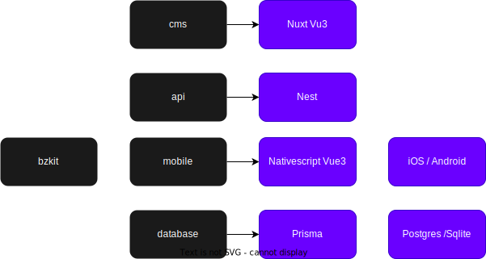

# bzkit

This is a fullstack JS kit for mobile, backend and front end code generation. Opiniated with best practices and Ready for production.
Created by Bazaks Ltd - https://bazaks.com

## Frameworks used

- Nuxt (Vue3)
- Nativescript (Vue3). This is still in beta but we using it because we don't want to switch between vue2 and vue3.
- Prisma (Orm Database migration)
- Nest for api
- CASL base on ABAC (Attribute Base Access Control) same as IAM of AWS
- Tailwind Css (Used both in Nativescript and Nuxt)
- PNPM

## Knowledge

Modern Javascript is required, we are also centering around Vue3 which is a must and a little of Angular knowledge for Nest.

- https://vuejs.org/
- https://nuxt.com/
- https://www.prisma.io/
- https://nativescript-vue.org/en/docs/introduction/
- https://casl.js.org/v6/en/guide/intro/
- https://tailwindcss.com/
